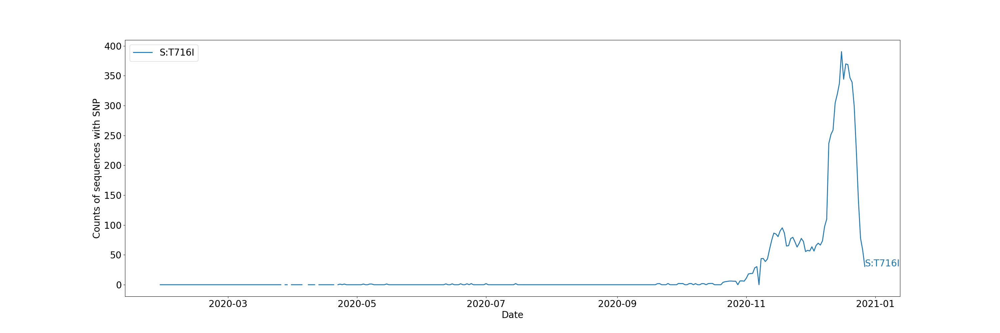
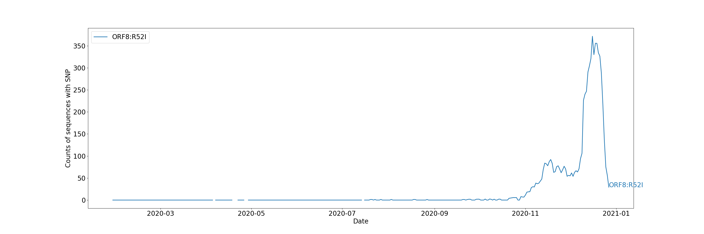

# Mutation report
Date report run: 2021-01-05 

### Contents

 - [variant_of_concern](#variant_of_concern)

## Amino acid change summaries

This report details the collection of amino acid changes characteristic of the variant of concern

| SNP of interest   |   Number of sequences in the UK | Date range               |   Number of adm2s present |
|:------------------|--------------------------------:|:-------------------------|--------------------------:|
| orf1ab:T1001I     |                            7221 | 2020-03-29 to 2020-12-27 |                        79 |
| orf1ab:A1708D     |                            6946 | 2020-09-20 to 2020-12-27 |                        78 |
| orf1ab:I2230T     |                            7114 | 2020-03-25 to 2020-12-27 |                        78 |
| S:N501Y           |                            7638 | 2020-06-08 to 2020-12-29 |                        80 |
| S:A570D           |                            7137 | 2020-09-20 to 2020-12-27 |                        78 |
| S:P681H           |                            7230 | 2020-03-23 to 2020-12-27 |                        78 |
| S:T716I           |                            7195 | 2020-03-27 to 2020-12-27 |                        80 |
| S:S982A           |                            7136 | 2020-09-20 to 2020-12-27 |                        78 |
| S:D1118H          |                            7146 | 2020-09-20 to 2020-12-27 |                        78 |
| ORF8:Q27*         |                            6972 | 2020-03-13 to 2020-12-27 |                        77 |
| ORF8:R52I         |                            6933 | 2020-04-06 to 2020-12-27 |                        78 |
| ORF8:Y73C         |                            6902 | 2020-09-20 to 2020-12-27 |                        78 |
| N:D3L             |                            7135 | 2020-03-20 to 2020-12-27 |                        78 |
| N:S235F           |                            7109 | 2020-09-17 to 2020-12-27 |                        78 |

> Rolling seven day average of SNP frequency over time

> Rolling seven day average of SNP counts over time

> Co-occurence matrix

### orf1ab T1001I

There are sequences with orf1ab:T1001I from 79 admin2 regions
The top five are:
- 3.59% (259) in NORFOLK
- 2.51% (181) in HAMPSHIRE
- 1.73% (125) in EAST_SUSSEX
- 1.66% (120) in BEDFORDSHIRE|BRACKNELL_FOREST|BUCKINGHAMSHIRE|CENTRAL_BEDFORDSHIRE|ESSEX|GREATER_LONDON|HERTFORDSHIRE|KENT|LUTON|MEDWAY|MILTON_KEYNES|NORTHAMPTONSHIRE|READING|SLOUGH|SUFFOLK|SURREY|THURROCK|WEST_BERKSHIRE|WINDSOR_AND_MAIDENHEAD|WOKINGHAM
- 1.56% (113) in BIRMINGHAM|COVENTRY|DUDLEY|SANDWELL|SOLIHULL|WALSALL|WOLVERHAMPTON

### orf1ab A1708D

There are sequences with orf1ab:A1708D from 78 admin2 regions
The top five are:
- 3.63% (252) in NORFOLK
- 2.58% (179) in HAMPSHIRE
- 1.76% (122) in EAST_SUSSEX
- 1.67% (116) in BEDFORDSHIRE|BRACKNELL_FOREST|BUCKINGHAMSHIRE|CENTRAL_BEDFORDSHIRE|ESSEX|GREATER_LONDON|HERTFORDSHIRE|KENT|LUTON|MEDWAY|MILTON_KEYNES|NORTHAMPTONSHIRE|READING|SLOUGH|SUFFOLK|SURREY|THURROCK|WEST_BERKSHIRE|WINDSOR_AND_MAIDENHEAD|WOKINGHAM
- 1.58% (110) in BIRMINGHAM|COVENTRY|DUDLEY|SANDWELL|SOLIHULL|WALSALL|WOLVERHAMPTON

### orf1ab I2230T

There are sequences with orf1ab:I2230T from 78 admin2 regions
The top five are:
- 3.57% (254) in NORFOLK
- 2.53% (180) in HAMPSHIRE
- 1.74% (124) in EAST_SUSSEX
- 1.64% (117) in BEDFORDSHIRE|BRACKNELL_FOREST|BUCKINGHAMSHIRE|CENTRAL_BEDFORDSHIRE|ESSEX|GREATER_LONDON|HERTFORDSHIRE|KENT|LUTON|MEDWAY|MILTON_KEYNES|NORTHAMPTONSHIRE|READING|SLOUGH|SUFFOLK|SURREY|THURROCK|WEST_BERKSHIRE|WINDSOR_AND_MAIDENHEAD|WOKINGHAM
- 1.59% (113) in BIRMINGHAM|COVENTRY|DUDLEY|SANDWELL|SOLIHULL|WALSALL|WOLVERHAMPTON

### S N501Y

There are sequences with S:N501Y from 80 admin2 regions
The top five are:
- 3.95% (302) in BRIDGEND
- 3.12% (238) in NORFOLK
- 2.33% (178) in HAMPSHIRE
- 1.62% (124) in EAST_SUSSEX
- 1.56% (119) in BEDFORDSHIRE|BRACKNELL_FOREST|BUCKINGHAMSHIRE|CENTRAL_BEDFORDSHIRE|ESSEX|GREATER_LONDON|HERTFORDSHIRE|KENT|LUTON|MEDWAY|MILTON_KEYNES|NORTHAMPTONSHIRE|READING|SLOUGH|SUFFOLK|SURREY|THURROCK|WEST_BERKSHIRE|WINDSOR_AND_MAIDENHEAD|WOKINGHAM

### S A570D

There are sequences with S:A570D from 78 admin2 regions
The top five are:
- 3.59% (256) in NORFOLK
- 2.54% (181) in HAMPSHIRE
- 1.75% (125) in EAST_SUSSEX
- 1.67% (119) in BEDFORDSHIRE|BRACKNELL_FOREST|BUCKINGHAMSHIRE|CENTRAL_BEDFORDSHIRE|ESSEX|GREATER_LONDON|HERTFORDSHIRE|KENT|LUTON|MEDWAY|MILTON_KEYNES|NORTHAMPTONSHIRE|READING|SLOUGH|SUFFOLK|SURREY|THURROCK|WEST_BERKSHIRE|WINDSOR_AND_MAIDENHEAD|WOKINGHAM
- 1.58% (113) in BIRMINGHAM|COVENTRY|DUDLEY|SANDWELL|SOLIHULL|WALSALL|WOLVERHAMPTON

### S P681H

There are sequences with S:P681H from 78 admin2 regions
The top five are:
- 3.61% (261) in NORFOLK
- 1.73% (125) in EAST_SUSSEX
- 1.65% (119) in BEDFORDSHIRE|BRACKNELL_FOREST|BUCKINGHAMSHIRE|CENTRAL_BEDFORDSHIRE|ESSEX|GREATER_LONDON|HERTFORDSHIRE|KENT|LUTON|MEDWAY|MILTON_KEYNES|NORTHAMPTONSHIRE|READING|SLOUGH|SUFFOLK|SURREY|THURROCK|WEST_BERKSHIRE|WINDSOR_AND_MAIDENHEAD|WOKINGHAM
- 1.58% (114) in BIRMINGHAM|COVENTRY|DUDLEY|SANDWELL|SOLIHULL|WALSALL|WOLVERHAMPTON
- 0.87% (63) in DURHAM

### S T716I

There are sequences with S:T716I from 80 admin2 regions
The top five are:
- 3.56% (256) in NORFOLK
- 2.52% (181) in HAMPSHIRE
- 1.74% (125) in EAST_SUSSEX
- 1.64% (118) in BEDFORDSHIRE|BRACKNELL_FOREST|BUCKINGHAMSHIRE|CENTRAL_BEDFORDSHIRE|ESSEX|GREATER_LONDON|HERTFORDSHIRE|KENT|LUTON|MEDWAY|MILTON_KEYNES|NORTHAMPTONSHIRE|READING|SLOUGH|SUFFOLK|SURREY|THURROCK|WEST_BERKSHIRE|WINDSOR_AND_MAIDENHEAD|WOKINGHAM
- 1.57% (113) in BIRMINGHAM|COVENTRY|DUDLEY|SANDWELL|SOLIHULL|WALSALL|WOLVERHAMPTON

### S S982A

There are sequences with S:S982A from 78 admin2 regions
The top five are:
- 3.59% (256) in NORFOLK
- 2.54% (181) in HAMPSHIRE
- 1.75% (125) in EAST_SUSSEX
- 1.64% (117) in BEDFORDSHIRE|BRACKNELL_FOREST|BUCKINGHAMSHIRE|CENTRAL_BEDFORDSHIRE|ESSEX|GREATER_LONDON|HERTFORDSHIRE|KENT|LUTON|MEDWAY|MILTON_KEYNES|NORTHAMPTONSHIRE|READING|SLOUGH|SUFFOLK|SURREY|THURROCK|WEST_BERKSHIRE|WINDSOR_AND_MAIDENHEAD|WOKINGHAM
- 1.58% (113) in BIRMINGHAM|COVENTRY|DUDLEY|SANDWELL|SOLIHULL|WALSALL|WOLVERHAMPTON

### S D1118H

There are sequences with S:D1118H from 78 admin2 regions
The top five are:
- 3.6% (257) in NORFOLK
- 2.53% (181) in HAMPSHIRE
- 1.75% (125) in EAST_SUSSEX
- 1.67% (119) in BEDFORDSHIRE|BRACKNELL_FOREST|BUCKINGHAMSHIRE|CENTRAL_BEDFORDSHIRE|ESSEX|GREATER_LONDON|HERTFORDSHIRE|KENT|LUTON|MEDWAY|MILTON_KEYNES|NORTHAMPTONSHIRE|READING|SLOUGH|SUFFOLK|SURREY|THURROCK|WEST_BERKSHIRE|WINDSOR_AND_MAIDENHEAD|WOKINGHAM
- 1.58% (113) in BIRMINGHAM|COVENTRY|DUDLEY|SANDWELL|SOLIHULL|WALSALL|WOLVERHAMPTON

### ORF8 Q27*

There are sequences with ORF8:Q27* from 77 admin2 regions
The top five are:
- 3.69% (257) in NORFOLK
- 2.52% (176) in HAMPSHIRE
- 1.69% (118) in EAST_SUSSEX
- 1.62% (113) in BEDFORDSHIRE|BRACKNELL_FOREST|BUCKINGHAMSHIRE|CENTRAL_BEDFORDSHIRE|ESSEX|GREATER_LONDON|HERTFORDSHIRE|KENT|LUTON|MEDWAY|MILTON_KEYNES|NORTHAMPTONSHIRE|READING|SLOUGH|SUFFOLK|SURREY|THURROCK|WEST_BERKSHIRE|WINDSOR_AND_MAIDENHEAD|WOKINGHAM
- 1.58% (110) in BIRMINGHAM|COVENTRY|DUDLEY|SANDWELL|SOLIHULL|WALSALL|WOLVERHAMPTON

### ORF8 R52I

There are sequences with ORF8:R52I from 78 admin2 regions
The top five are:
- 3.71% (257) in NORFOLK
- 2.54% (176) in HAMPSHIRE
- 1.7% (118) in EAST_SUSSEX
- 1.6% (111) in BIRMINGHAM|COVENTRY|DUDLEY|SANDWELL|SOLIHULL|WALSALL|WOLVERHAMPTON
- 1.6% (111) in BEDFORDSHIRE|BRACKNELL_FOREST|BUCKINGHAMSHIRE|CENTRAL_BEDFORDSHIRE|ESSEX|GREATER_LONDON|HERTFORDSHIRE|KENT|LUTON|MEDWAY|MILTON_KEYNES|NORTHAMPTONSHIRE|READING|SLOUGH|SUFFOLK|SURREY|THURROCK|WEST_BERKSHIRE|WINDSOR_AND_MAIDENHEAD|WOKINGHAM

### ORF8 Y73C

There are sequences with ORF8:Y73C from 78 admin2 regions
The top five are:
- 3.72% (257) in NORFOLK
- 2.55% (176) in HAMPSHIRE
- 1.71% (118) in EAST_SUSSEX
- 1.62% (112) in BEDFORDSHIRE|BRACKNELL_FOREST|BUCKINGHAMSHIRE|CENTRAL_BEDFORDSHIRE|ESSEX|GREATER_LONDON|HERTFORDSHIRE|KENT|LUTON|MEDWAY|MILTON_KEYNES|NORTHAMPTONSHIRE|READING|SLOUGH|SUFFOLK|SURREY|THURROCK|WEST_BERKSHIRE|WINDSOR_AND_MAIDENHEAD|WOKINGHAM
- 1.55% (107) in BIRMINGHAM|COVENTRY|DUDLEY|SANDWELL|SOLIHULL|WALSALL|WOLVERHAMPTON

### N D3L

There are sequences with N:D3L from 78 admin2 regions
The top five are:
- 3.62% (258) in NORFOLK
- 2.52% (180) in HAMPSHIRE
- 1.75% (125) in EAST_SUSSEX
- 1.65% (118) in BEDFORDSHIRE|BRACKNELL_FOREST|BUCKINGHAMSHIRE|CENTRAL_BEDFORDSHIRE|ESSEX|GREATER_LONDON|HERTFORDSHIRE|KENT|LUTON|MEDWAY|MILTON_KEYNES|NORTHAMPTONSHIRE|READING|SLOUGH|SUFFOLK|SURREY|THURROCK|WEST_BERKSHIRE|WINDSOR_AND_MAIDENHEAD|WOKINGHAM
- 1.58% (113) in BIRMINGHAM|COVENTRY|DUDLEY|SANDWELL|SOLIHULL|WALSALL|WOLVERHAMPTON

### N S235F

There are sequences with N:S235F from 78 admin2 regions
The top five are:
- 3.59% (255) in NORFOLK
- 2.55% (181) in HAMPSHIRE
- 1.73% (123) in EAST_SUSSEX
- 1.66% (118) in BEDFORDSHIRE|BRACKNELL_FOREST|BUCKINGHAMSHIRE|CENTRAL_BEDFORDSHIRE|ESSEX|GREATER_LONDON|HERTFORDSHIRE|KENT|LUTON|MEDWAY|MILTON_KEYNES|NORTHAMPTONSHIRE|READING|SLOUGH|SUFFOLK|SURREY|THURROCK|WEST_BERKSHIRE|WINDSOR_AND_MAIDENHEAD|WOKINGHAM
- 1.59% (113) in BIRMINGHAM|COVENTRY|DUDLEY|SANDWELL|SOLIHULL|WALSALL|WOLVERHAMPTON

